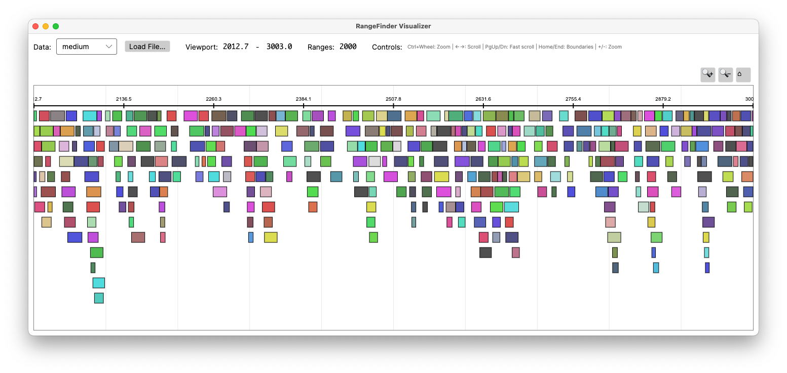

# RangeFinder.Visualizer

> ⚠️ **Experimental Project**: This visualizer is an experimental project generated by Claude AI as part of the RangeFinder ecosystem development. It demonstrates the capabilities of the RangeFinder library but may contain bugs or incomplete features.

A high-performance range visualization tool built with Avalonia UI for exploring and analyzing numeric range data using the RangeFinder library.


*Screenshot showing the visualizer displaying 2000 ranges from the "medium" dataset with interactive navigation controls*

## Features

### 📊 **Data Visualization**
- **Interactive range display** with zoom and pan capabilities
- **Color-coded ranges** based on value hash for easy identification
- **High-performance rendering** optimized for large datasets
- **Responsive viewport** with smooth navigation

### 📁 **Data Loading**
- **File Support**: Load CSV and Parquet files using RangeFinder.IO
- **Sample Data**: Built-in sample datasets (timeseries, overlapping, large)
- **Generated Data**: Procedurally generated test datasets (sparse, medium, dense)
- **Drag-and-drop file loading** with automatic format detection

### ⌨️ **Keyboard Navigation**
- **Arrow Keys** (←→): Slow scroll (5% of viewport)
- **Page Up/Down**: Fast scroll (50% of viewport)
- **Home/End**: Jump to data boundaries
- **+/-**: Zoom in/out at center
- **Ctrl + Mouse Wheel**: Zoom at cursor position

### 🖱️ **Mouse Interaction**
- **Click and Drag**: Pan through the data
- **Mouse Wheel**: Scroll through ranges
- **Ctrl + Mouse Wheel**: Precision zoom at cursor
- **Hover Tooltips**: Range details on mouse hover

## Getting Started

### Prerequisites
- .NET 8.0 SDK
- Windows, macOS, or Linux

### Building and Running

```bash
# Clone the repository (if not already done)
git clone <repository-url>
cd RangeFinder/RangeFinder.Visualizer

# Build the project
dotnet build

# Run the visualizer
dotnet run
```

### Sample Data

The visualizer includes three sample CSV files that are automatically copied to the output directory:

- **`timeseries_sample.csv`**: Sequential timeline data (20 ranges)
- **`overlapping_sample.csv`**: Overlapping process data (20 ranges)
- **`large_dataset_sample.csv`**: Large dataset sample (30 ranges)

## Embedding in Your Avalonia Application

You can easily embed the range visualization controls in your own Avalonia applications:

### 1. Add Project References

```xml
<ItemGroup>
  <ProjectReference Include="path/to/RangeFinder.Core/RangeFinder.Core.csproj" />
  <ProjectReference Include="path/to/RangeFinder.IO/RangeFinder.IO.csproj" />
  <ProjectReference Include="path/to/RangeFinder.Visualizer/RangeFinder.Visualizer.csproj" />
</ItemGroup>
```

### 2. Use the RangeViewer Control

```xml
<Window xmlns="https://github.com/avaloniaui"
        xmlns:controls="using:RangeFinder.Visualizer.Controls">
  
  <controls:RangeViewer StringRanges="{Binding MyRanges}"
                        ViewportStart="{Binding ViewportStart, Mode=TwoWay}"
                        ViewportEnd="{Binding ViewportEnd, Mode=TwoWay}"
                        DataMin="{Binding DataMin, Mode=TwoWay}"
                        DataMax="{Binding DataMax, Mode=TwoWay}"
                        ShowControls="True" />
</Window>
```

### 3. Bind Your Data

```csharp
public class MyViewModel : ViewModelBase
{
    public ObservableCollection<NumericRange<double, string>> MyRanges { get; set; }
    public double ViewportStart { get; set; }
    public double ViewportEnd { get; set; }
    public double DataMin { get; set; }
    public double DataMax { get; set; }
}
```

### 4. Handle Events (Optional)

```csharp
// In your code-behind or view model
rangeViewer.PanRequested += (sender, delta) => { /* Handle panning */ };
rangeViewer.ScrollRequested += (sender, args) => { /* Handle zooming */ };
```

## Supported File Formats

### CSV Format
```csv
Start,End,Value
0.0,5.2,Task_001
6.1,11.3,Task_002
12.8,18.4,Task_003
```

### Parquet Format
Binary format with the same schema: `Start` (double), `End` (double), `Value` (string)

## Data Types

The visualizer currently supports:
- **Range Type**: `NumericRange<double, string>`
- **Numeric Values**: Double precision floating point
- **Associated Data**: String labels/identifiers

## Architecture

```
RangeFinder.Visualizer/
├── Controls/                    # Custom Avalonia controls
│   ├── RangeCanvas.cs           # High-performance range renderer
│   └── RangeViewer.*            # User control with interaction
├── ViewModels/                  # MVVM view models
│   └── MainWindowViewModel.cs   # Main application logic
├── Views/                       # Avalonia UI views
│   └── MainWindow.*             # Main application window
├── SampleData/                  # Sample CSV files
└── README.md                    # This file
```

## Dependencies

- **Avalonia UI**: Cross-platform .NET UI framework
- **RangeFinder.Core**: Core range data structures and algorithms
- **RangeFinder.IO**: File loading (CSV/Parquet support)
- **CsvHelper**: CSV parsing library
- **Parquet.NET**: Parquet file support

## Performance Notes

- Optimized for datasets up to 100K ranges
- Uses intelligent viewport culling for smooth rendering
- Lazy loading and caching for improved responsiveness
- Hardware-accelerated rendering via Avalonia.Skia

## Known Limitations

⚠️ **As an experimental project, the visualizer has several limitations:**

- Touch/pinch gestures not implemented
- Limited error handling for malformed data files
- No data export functionality
- No customizable color schemes
- No range selection or editing capabilities
- Single-threaded data loading for large files

## Contributing

This is an experimental demonstration project. For the main RangeFinder library development, please refer to the root project documentation.

## License

This project follows the same license as the main RangeFinder library.

---

**Generated by Claude AI** | Part of the RangeFinder ecosystem